---
marp: true
theme: dsi-certificates-theme
_class: invert
paginate: true
---

# Data Visualization: Introduction and Overview

```code
$ echo "Data Science Institute"
```

---

# Welcome! 

Introductions and housekeeping

---

# Overview of this slide deck

- Explore why we should care about data visualization
- Question what makes ‘good’ data visualization
- Introduce a range of software and tools that are used for data visualization

---

# Case Study: Why should we care about data visualization?

---

- No matter how good or groundbreaking our data science work is, if we can’t communicate it, its impact will be severely limited.
- Often, the best way to communicate insights from data is in visual format.
- We can see examples of this idea throughout history.

---

- By plotting black bars at the locations of each cholera death, Dr. John Snow was able to provide evidence [tracing an 1854 outbreak](https://www.ph.ucla.edu/epi/snow/snowmap1_1854.html) to a specific water pump.

- This visualization is [often cited](https://www.esri.com/arcgis-blog/products/arcgis-pro/mapping/something-in-the-water-the-mythology-of-snows-map-of-cholera/) as one of the early origins of the field of epidemiology.

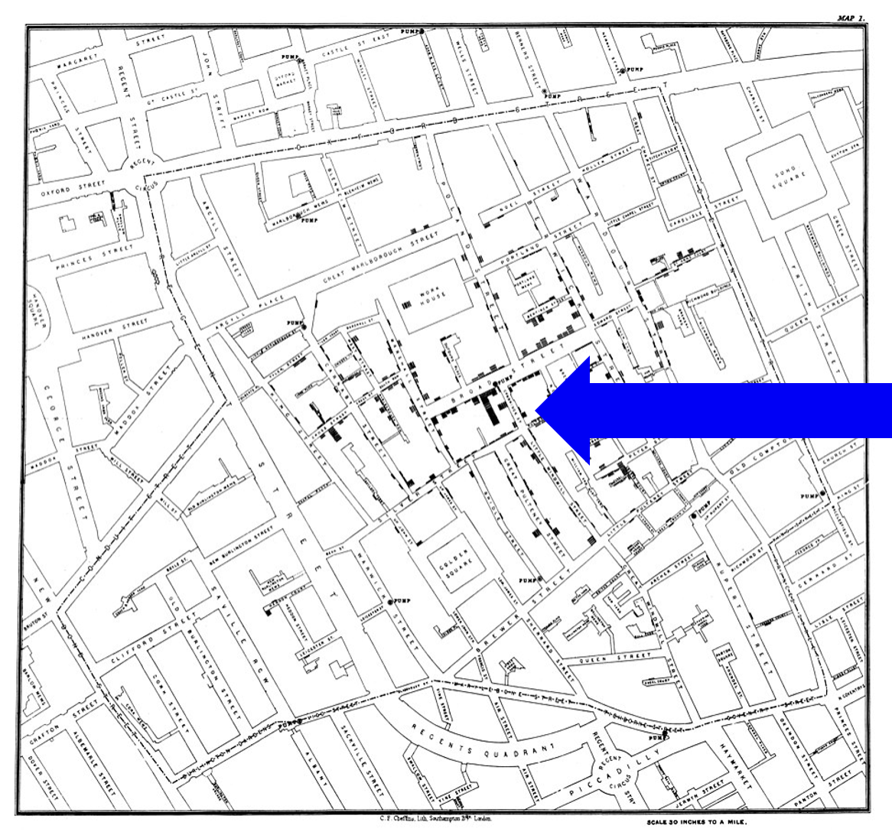


--- 

- This 1858 visualization by Florence Nightingale shows soldiers’ deaths due to wounds in battle (pink), other causes (black), and disease (blue) and was [used to advocate](https://wellcomecollection.org/works/jxwtskzc/items?canvas=7) for prioritizing nutrition, ventilation, and shelter, revolutionizing army medicine.


---

- Minard, in 1869, visualized: "Figurative Map of the successive losses in men of the French Army in the Russian campaign 1812–1813."

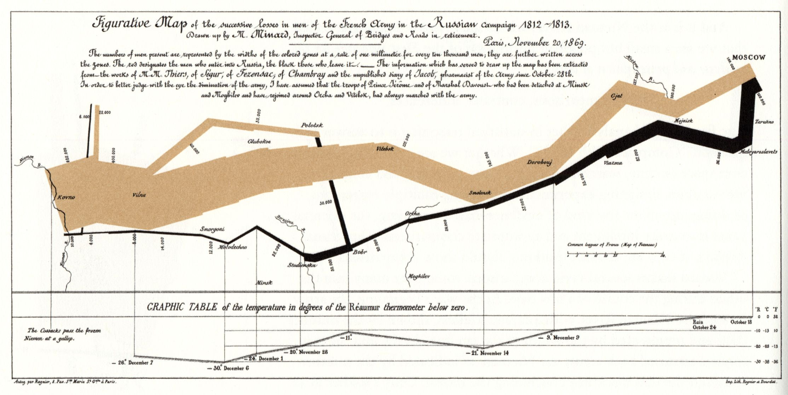

---

# So why visualize information?

- These historical examples gave us different reasons
    - Cholera outbreak → Allows us to see data in context 
    - Nightingale's rose diagram → Presents an argument and advocates
    - Napoleon's Russian Campaign → An example of story telling

---

But data visualization is not always so straightforward...

--- 

# The Challenger Disaster

- In 1986, the space shuttle *Challenger* exploded 73 seconds after launch, killing everyone aboard.

- The explosion occurred because hot propellant gases burned through rubber seals (“O-rings”) on the shuttle’s right solid rocket booster.

- For months, up until the night before the launch, concerns about the O-rings and the safety of the launch had been raised, but launch proceeded anyway

--- 

# The Challenger Disaster - Tufte’s Graph

- In 1997, Edward Tufte famously published a visualization showing the relationship between temperature during launches of test shuttle flights (pre-*Challenger*) and incidents of damage to O-rings (image: Tufte, 1997 👇)

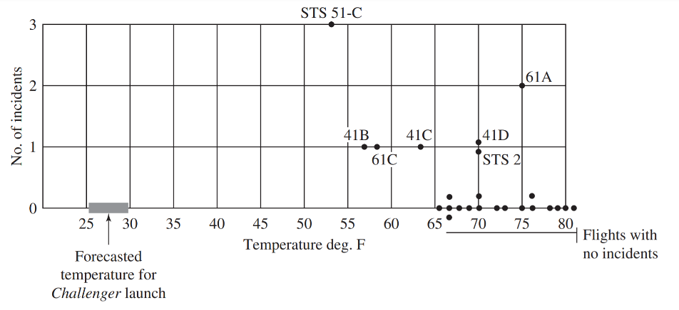

--- 

# The Challenger Disaster - Tufte’s Graph

- Tufte’s graph seems to show that as launch temperatures decreased, O-ring incident rate increased; thus, by launching at temperatures lower than those tested, NASA unnecessarily endangered _Challenger_ (image: Tufte, 1997 👇)


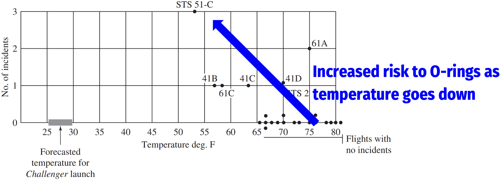

--- 

# The Challenger Disaster - Tufte’s Graph

- Tufte argued that the engineers responsible for communicating the results of the O-ring tests had failed to represent the data that might have saved the crew of _Challenger_.

- Tufte’s graph is used as a classic case study demonstrating the importance of data visualization as a way to communicate complex information.

- Another case of data visualization saving lives?

--- 

## The Challenger Disaster - But...

- The accuracy of Tufte’s visualization has [been](https://link.springer.com/content/pdf/10.1007/978-3-319-45193-0_12.pdf) [debated](https://link.springer.com/content/pdf/10.1007/s11948-002-0033-2.pdf), with Robison identifying several errors in Tufte’s use of data.
- Robison suggests that only one test launch had actually produced relevant O-ring temperature data, producing this visual instead: (image: Robison, 1997, 2002 👇)

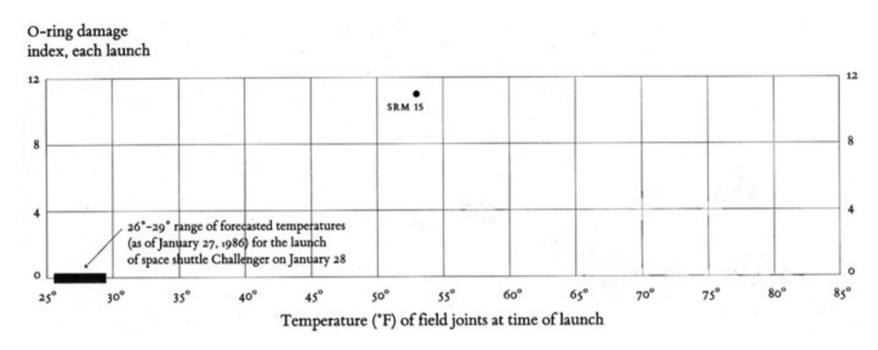

--- 

# The Challenger Disaster - But...

- Per Tufte, the *Challenger* disaster is a case where good data visualization could have facilitated understanding of complex data and saved lives.

- Per Robison, Tufte’s work is a case of bad data visualization unfairly placing blame and leading the audience to a faulty conclusion.

--- 

**The choices we make about visualizing our data have consequences - so how do we make better ones?**
### Activity: What is ‘good’ data visualization?

--- 

# Activity

- Look at the following examples of data visualizations. For each, consider:

    - Is the visualization pleasing to look at?

    - Does the visualization accurately represent data?

    - Can we understand what message the maker of the visualization is attempting to convey?

    - Consider factors such as colour, size, use of images. Is this a ‘good’ data visualization? Why or why not?


--- 

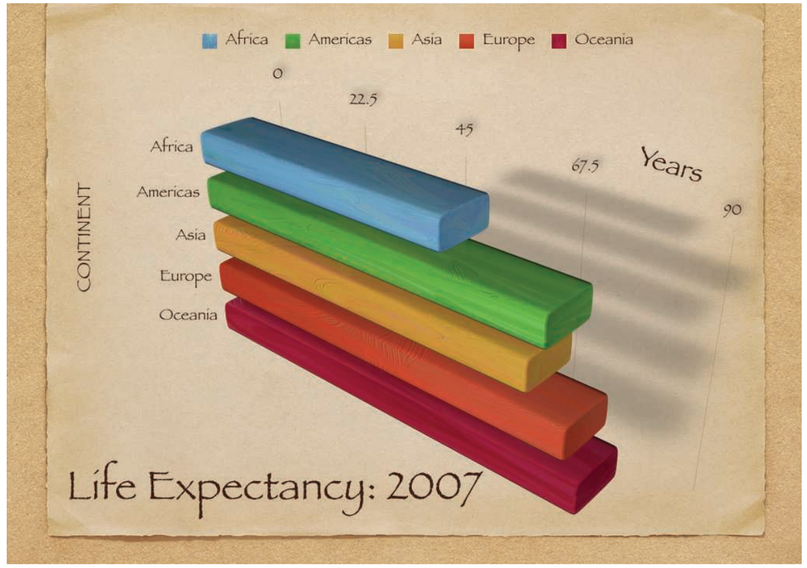

--- 

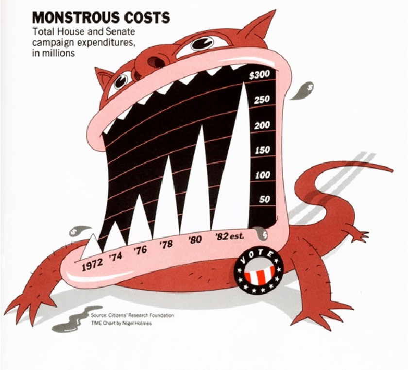

--- 

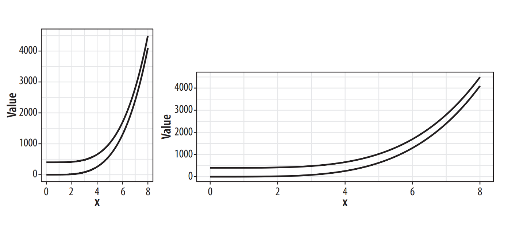
(The same data presented with two different aspect ratios)

--- 


--- 


[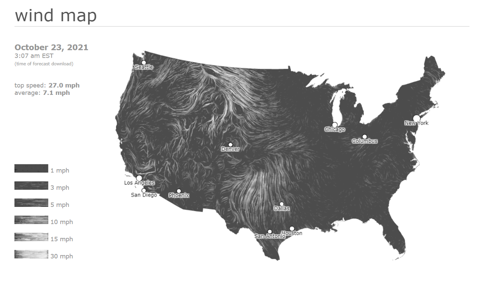](http://hint.fm/wind/)
(Click image to view interactive visualization)

--- 

# Activity

- Each of the questions corresponds to an important quality of data visualizations:

    - Is the visualization pleasing to look at? → **Aesthetic**

    - Does the visualization accurately and honestly present data? → **Substantive**

    - Can we understand what message the maker of the visualization is attempting to convey? → **Perceptual**

- We need to consider all of these qualities when evaluating and designing ‘good’ data visualizations


--- 

# What data visualization IS

- Dependent on:

    - **Context** → **_where and how_** will our visualization be used? (eg. academic journal, poster, infographic)

    - **Audience** → **_who_** is intended to use our visualization? (eg. subject experts, general public)

    - **Data structure** → **_what_** information do our data capture? (eg. quantities, relationships)

--- 

# What data visualization is NOT

- Hard and fast rules for every situation → **visualizing data means making decisions**

--- 

### What tools are used for data visualization?

--- 

# Tools for Data Visualization 

<!-- each png file can be found in the tools_for_data_visualization directory -->
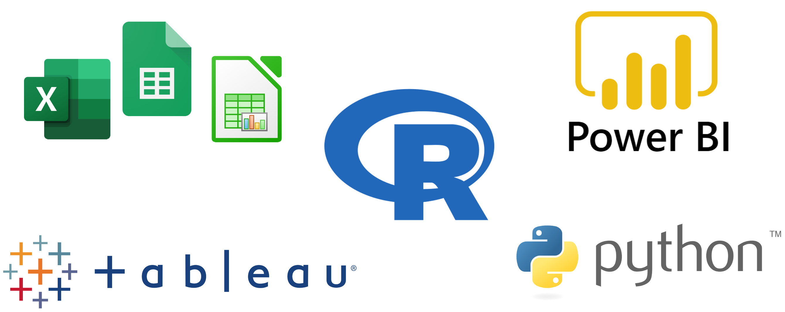

--- 

# Microsoft Excel (LibreOffice Calc, Google Sheets, etc)
<style scoped>
table {
  font-size: 20px;
}
</style>


| | |
|-----------------------------|---------------------------------------------------------------------------------|
| What is it                  | Spreadsheet software with ability to generate static data visualizations        |
| Access                      | - Excel is paid (part of MS Office Suite)<br>- Free alternatives such as Google Sheets and LibreOffice Calc                                       |
| Reproducible visualizations | - no                                                                            |
| Ease of use                 | - Point and click to select from pre-made visualizations<br>- Can serve as frontend for databases using Power Query                        |
| Use cases                   | - “First line tool” for data analysis and visualization<br>- pretty much everywhere|


---

# Microsoft Excel (LibreOffice Calc, Google Sheets, etc)

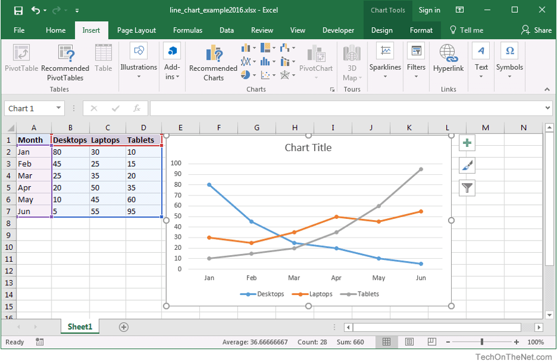

---

# Tableau, Tableau Public
<style scoped>
table {
  font-size: 20px;
}
</style>


| | |
|-----------------------------|--------------------------------------------------------------------------------------------------------------|
| What is it                  | Combines data from different sources (databases, spreadsheets) into interactive, dynamic visualizations on the web |
| Access                      | - Tableau Server and Desktop are paid <br> - Tableau Public is free **but** all visualizations are public and not saved locally |
| Reproducible visualizations | - no                                                                                                         |
| Ease of use                 | - Point and click to select from pre-made visualizations                                                     |
| Use cases                   | - Industry (designed for business intelligence), infographics for media                                      |

--- 

# Tableau, Tableau Public

Click each link to view and interact with public visualizations chosen as Tableau’s ‘Viz

of the Day’:
[🔗 left](https://public.tableau.com/app/profile/rahul7922/viz/Dinosaur2_16228076369930/Dinosaur), [🔗 middle](https://public.tableau.com/app/profile/arshad.ejaz/viz/Entry-leveljobsrequire3yearsofexperience_16304835725570/Dashboard), [🔗 right](https://public.tableau.com/app/profile/kasia.gasiewska.holc/viz/DwightSchrutesSurveillanceSystem/SurveillanceSystem)


--- 

# Microsoft Power BI
<style scoped>
table {
  font-size: 24px;
}
</style>
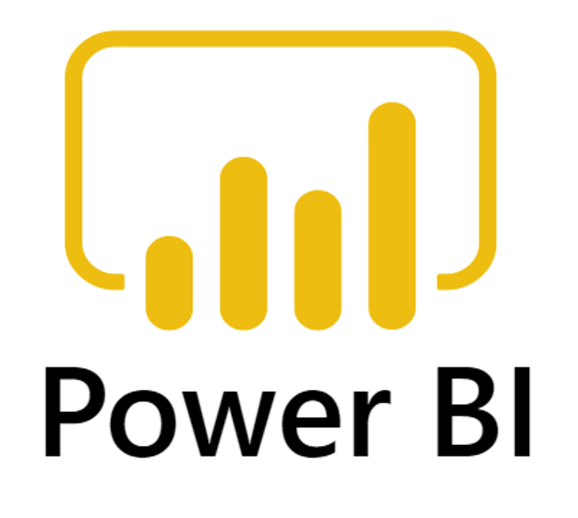

|                              |                                                                                                                |
|------------------------------|----------------------------------------------------------------------------------------------------------------|
| What is it                   | Combines data from different sources (databases, spreadsheets) into interactive, dynamic visualizations on the web |
| Access                       | Paid (part of MS Office Suite)                                                                                 |
| Reproducible visualizations  | no                                                                                                             |
| Ease of use                  | Drag and drop to select from pre-made visualizations<br>Can use DAX (Data Analysis Expressions) functions to perform operations on data |
| Use cases                    | Industry, government (designed for business intelligence)                                                      |

--- 

# Microsoft Power BI


--- 

# R
<style scoped>
table {
  font-size: 24px;
}
</style>


|                              |                                                                                                                |
|------------------------------|----------------------------------------------------------------------------------------------------------------|
| What is it                   | Programming language with libraries for data visualization (e.g., ggplot2, Plotly, RColorBrewer)               |
| Access                       | Free and open source [(https://www.r-project.org/COPYING)](https://www.r-project.org/COPYING)                                          |
| Reproducible visualizations  | yes                                                                                                            |
| Ease of use                  | Programming language; requires some coding knowledge                                                           |
| Use cases                    | Academia, industry, government; research and data science contexts                                             |

--- 

# R
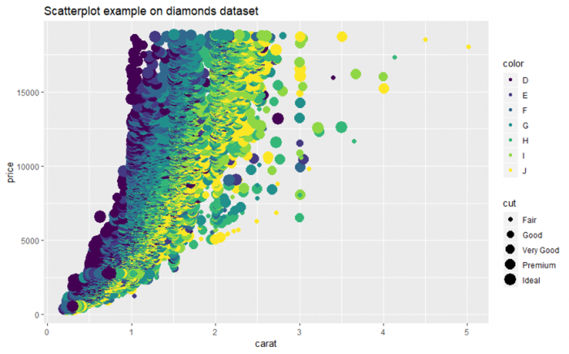

--- 

# Python
<style scoped>
table {
  font-size: 24px;
}
</style>


|                              |                                                                                                                |
|------------------------------|----------------------------------------------------------------------------------------------------------------|
| What is it                   | Programming language with libraries for data visualization (e.g., Matplotlib, Plotly)                           |
| Access                       | Free and open source [Python Software Foundation License](https://opensource.org/licenses/Python-2.0)           |
| Reproducible visualizations  | yes                                                                                                            |
| Ease of use                  | Programming language; requires some coding knowledge                                                           |
| Use cases                    | Government, industry, academia; data science and programming contexts                                         |


--- 

# Python

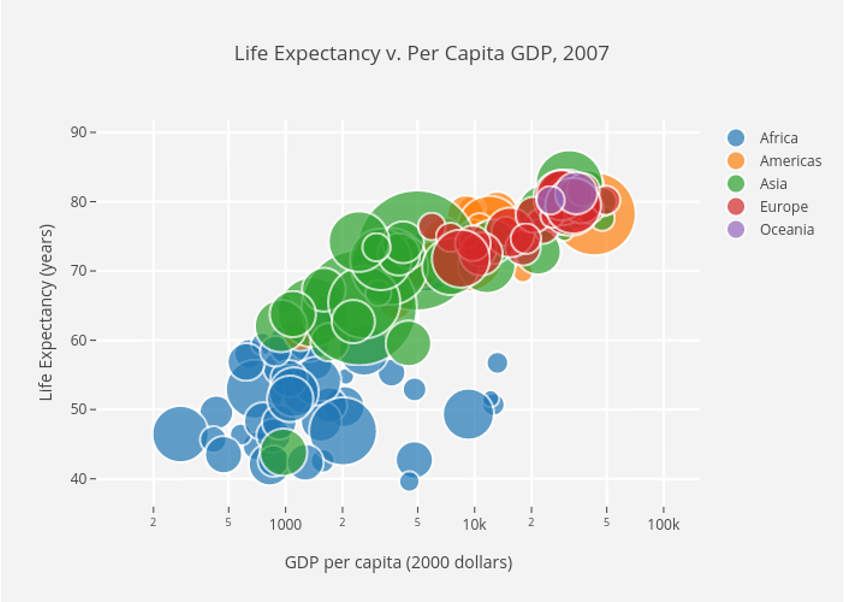

--- 

# For our purposes

- Step-by-step walkthroughs are focused on Python (MatPlotLib)
    - [Commonly](https://stackoverflow.blog/2017/10/10/impressive-growth-r/)[ ](https://stackoverflow.blog/2017/10/10/impressive-growth-r/)[used](https://journal.r-project.org/archive/2017-2/forwards.pdf) tool
    - Free and open source
    - Reproducible
    - LOTS of available resources online

**BUT...**

- General design principles will apply to creating data visualizations in whichever software you decide to use

--- 

# Coming Up in this Course - Topics

- **First Steps**
    - Get started
    - Make a plot (Matplotlib)
    - Thinking about reproducibility

- **Graphing Our Data**
    - Customize our plot appearance
    - Choosing the right visualization (perceptual qualities)

--- 

# Coming Up in this Course - Topics

- **Visualization with Purpose**
    - Subplots and combining visualizations
    - Colour theory and accessible design
    - Data visualization as advocacy

- **Getting Fancy**
    - Beyond matplotlib (Seaborn)
    - Interactive data visualizations (Plotly)
	- Qualitative data visualization

--- 

# Learning Outcomes of this Course

1. Create and customize data visualizations start to finish in Python
2. Use general design principles for creating accessible and equitable data visualizations in Python and other software
3. Use data visualization to purposely tell a story

