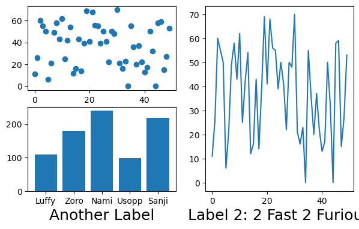
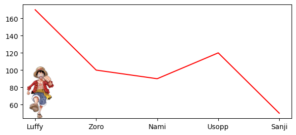
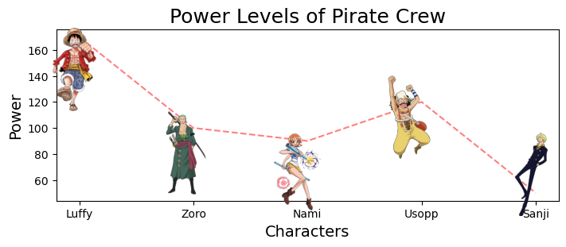

# Data Visualization: Subplots and Combining Visualizations

```code
$ echo "Data Sciences Institute"
```
---

# Overview of this slide deck, we will: 

- Learn about subplot notation in matplotlib
- Put multiple visualizations on the same axes objects
- Show errors
- Adjust figure layout

- Add images to plots

---

# Subplots

---

# Recall: How does matplotlib work?

- A **figure** is like a container that holds a set of **axes**
- The axes is our actual plot or graph
- A figure can hold multiple axes (like subplots)
- Every visual element of our plots – colour, legends, axis titles and scales, text – is called an **artist** and belongs to an axes (not to a figure)

---

# Setting up

- Let’s start by loading our libraries and generating some new sample data

    ```
    import numpy as np
    import matplotlib.pyplot as plt
    import pandas as pd
    import scipy
    import PIL
    import requests

    np.random.seed(613)
    x1 = np.arange(50)
    y1 = np.random.randint(0, 75,50)
    x2 = np.array(["Luffy", "Zoro", "Nami", "Usopp", "Sanji"])
    y2 = np.array([110, 180, 240, 99, 220])
    ```


---

# Introducing subplots

- In past lessons, to define our figure and its one axes, we would type:
    ```
    fig, ax = plt.subplots(figsize=(5, 3))
    ```
- Now we want to have two plots next to each other, so we just have to define multiple axes and their relative positions:
    ```
    fig,(ax1, ax2) = plt.subplots(ncols=2,
                            nrows=1,
                            figsize=(7, 3))
    ```


---

# Introducing subplots (cont.)

- Then we can use our new figure, with its two axes, and define the types of viz that we want to see in each

    ```
    fig, (ax1, ax2) = plt.subplots(ncols=2,
                            nrows=1,
                            figsize=(7, 3))
    ax1.scatter(x1,y1)
    ax2.bar(x2,y2)
    fig.show()
    ```


---

# Activity: Customizing our plots

- Refer to past slides and class activities to customize the subplots we just made
- Think about adding titles or annotations, or modifying colour, marker type, and fonts – differently for each subplot
- **Share your resulting images in the chat!**


---

# Subplots without a grid arrangement?

- We can also arrange the subplots within our figure by using **plt.subplot_mosaic()** 

    ```
    fig, someaxes = plt.subplot_mosaic([['ax1', 'ax3'],
                                    ['ax2', 'ax3']],
                                    figsize=(7, 4))
    ```
---


# Subplots without a grid arrangement - Data

- Once we’ve made our mosaic, we can add data to each of our subplots the same way we did before! Just reference each axes label in our someaxes list:

    ```
    fig, someaxes = plt.subplot_mosaic([['ax1', 'ax3'],
                                    ['ax2', 'ax3']],
                                    figsize=(7, 4))
    someaxes["ax1"].scatter(x1,y1)
    someaxes["ax2"].bar(x2,y2)
    someaxes["ax3"].plot(x1,y1)
    plt.show()
    ```
    
---

# Modify figure layout

---

# Layouts

- Let’s try adding some very large x axis titles to our previous plot

    ```
    fig, someaxes = plt.subplot_mosaic([['ax1', 'ax3'],
                                    ['ax2', 'ax3']],
                                    figsize=(7, 4)) 
    someaxes["ax1"].scatter(x1,y1)
    someaxes["ax2"].bar(x2,y2)
    someaxes["ax3"].plot(x1,y1)
    someaxes["ax1"].set_xlabel('A Big Label',fontsize=18)
    someaxes["ax2"].set_xlabel('Another Label',fontsize=18)
    someaxes["ax3"].set_xlabel('Label 2: 2 Fast 2 Furious',fontsize=18 )
    ```

---

# Layouts



- The axis title for our scatter plot doesn’t appear, and the axis title for our line plot is cut off! 

---

# Layouts

- We can use layouts to make sure that our subplots fit neatly in our figure area
- There are two main kinds of layout we consider:
  - **Tight layout** adjusts subplots so tick labels, axis labels, and titles don't overlap or leave the figure area
  - **Constrained layout** works similarly except it also fits things like legends or colorbars

---

# Layouts

- First let’s see how a constrained layout changes our plot:

    ```
    fig, someaxes = plt.subplot_mosaic([['ax1', 'ax3'],
                                    ['ax2', 'ax3']],
                                    figsize=(7, 4),
                                    layout = "constrained")
    someaxes["ax1"].scatter(x1,y1)
    someaxes["ax2"].bar(x2,y2)
    someaxes["ax3"].plot(x1,y1)
    someaxes["ax1"].set_xlabel('A Big Label', fontsize=18)
    someaxes["ax2"].set_xlabel('Another Label', fontsize=18)
    someaxes["ax3"].set_xlabel('Label 2: 2 Fast 2 Furious', fontsize=18)

    ```


---

# Layouts Comparison


---

# Multiple viz on one axes

---

# Multiple viz on one axes object

- Super easy: just call multiple plot methods on the same axes

    ```
    # first make our sample data
    x = np.array(["Luffy", "Zoro", "Nami", "Usopp", "Sanji"])
    y1 = np.array([110, 180, 240, 99, 220])
    y2 = np.array([170, 100, 90, 120, 50])

    # define our figure and axes (just one this time)
    fig, ax = plt.subplots(figsize=(7, 3))

    # now call both bar and plot elements to the same axes (ax)
    ax.bar(x, y1,
    color = "indigo")
    ax.plot(x, y2,
    color = "red")
    ```

---

# Multiple viz on one axes object


**Annotations, shapes, etc. can be added as usual!**

---

# Add error information

- First, calculate standard deviation of our data
    ```
    y2_sd = np.std(y2)
    ```
- Then plot our line as before
    ```
    fig, ax = plt.subplots(figsize=(7, 3))
    ax.plot(x, y2, color = "red")
    ```

---

# Add error information

- Then use **errorbar()** to add in our error line (standard deviation in this case, but could be whatever value you calculated)
  - yerr specifies that we’re plotting vertical error bars
  - fmt makes sure we’re not plotting the actual data points, only the error

    ```
    ax.errorbar(x, #our x values
            y2, #our y values
            yerr = y2_sd,
            fmt = "none")
    ```

---

# Customizing errorbar appearance

```
fig, ax = plt.subplots(figsize=(7, 3))
ax.plot(x, y2,
        color = "red")
ax.errorbar(x,
        y2,
        yerr = y2_sd,
        fmt = "none",
        ecolor= "indigo",
        elinewidth= 4,
        capsize = 6,
        capthick= 4 )
```


---

# Errorevery

- If we don’t want to see error bars for every single point, we can specify intervals using **errorevery** 

    ```
    ax.errorbar(x,
            y2,
            yerr = y2_sd,
            fmt = "none",
            ecolor = "indigo",
            elinewidth = 4,
            capsize = 6,
            capthick = 4,
            errorevery= 2 )
    ```

---

# Add images to plots

---


<!-- 
You know enough at this point to do this! It’s not ~necessary~ but it’s a nice thing to know and can be a nice touch when we’re doing data viz in public communications settings. 
-->

---

# Using images from the internet

- First let’s load our libraries
    ```
    from PIL import Image # to open images
    import requests # to get images from URLs
    from io import BytesIO # to store images
    ```

- Then get our image from the internet
    ```
    response = requests.get('https://upload.wikimedia.org/wikipedia/en/c/cb/Monkey_D_Luffy.png')
    image_file = BytesIO(response.content)
    image = Image.open(image_file)
    ```

---

# Adding an image to a plot

- Now make a basic line plot (reusing our data)
    ```
    fig, ax = plt.subplots(figsize=(7, 3))
    ax.plot(x, y2, color = "red")
    ```

- Then overlay a new axis (‘ax_image’) on our figure (on top of ‘ax’) to act as a container for our image
    ```
    ax_image = fig.add_axes([0.1, # x coordinate (ON FIGURE, NOT AXES)
                            0.11, # y coordinate (ON FIGURE, NOT AXES)
                            0.15, # image width
                            0.35] # image height)

    ```
---

# Adding an image to a plot

- Then add imshow() to add the image we prepared before

    ```
    fig, ax = plt.subplots(figsize=(7, 3))
    ax.plot(x, y2,
            color = "red")

    ax_image = fig.add_axes([0.1, 0.11, 0.15, 0.35])

    ax_image.imshow(image)
    ax_image.axis('off’)
    ```

---

# Adding images to our plots



---

# What can we make?



---

# Saving our visualizations

---
- First, let's define where we want to save our visualization
    ```
    path = 'C:/Users/...'
    # can be full path or relative path
    filename = '/fig1a.png'
    ```
- Then save the visualization
    ```
    plt.savefig(path+filename, dpi=300)
    # note that path shouldn't end with / since filename starts with it
    ```
<!--Other possible parameters for this can be found in the documentation: https://matplotlib.org/stable/api/_as_gen/matplotlib.pyplot.savefig.html-->

---

# Assignment 3 

---

# Feedback!

---

# Next session

- Data Visualization as Advocacy
- Examples of data visualization used for advocacy, and best practices
- Form, representation, and giving credit as means of incorporating advocacy into our own data visualization practices
- Moving beyond matplotlib – other data viz libraries in Python
